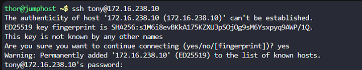
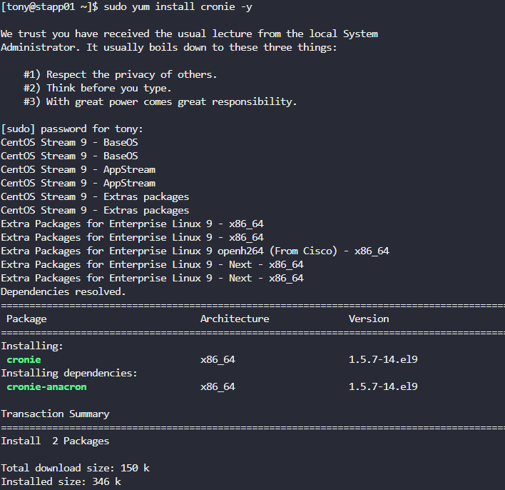
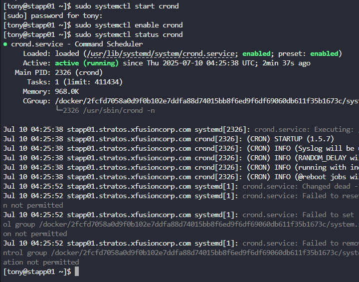

Menginstal paket cronie pada semua app server (stapp01, stapp02, stapp03).
Memastikan layanan crond berjalan dan aktif secara otomatis setelah reboot.
Menambahkan cron job */5 * * * * echo hello > /tmp/cron_text untuk pengguna root pada setiap server.

Langkah 1: Akses Setiap App Server melalui SSH

Langkah 2:Instal Paket cronie

Langkah 3: Aktifkan dan Jalankan Layanan crond

Langkah 4: Tambahkan Cron Job untuk Root
jalankan sudo crontab -e

Verifikasi Hasil

