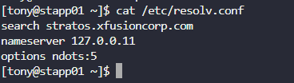
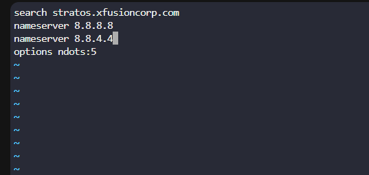

Menambahkan Google public DNS nameservers (8.8.8.8 dan 8.8.4.4) pada App Server 1 (stapp01) untuk mengatasi masalah resolusi DNS.
Memastikan konfigurasi aman, persisten (bertahan setelah reboot), dan tidak mengganggu operasional server.

Langkah 1: Periksa Konfigurasi DNS Saat Ini

Langkah 2: Tambahkan Google Public DNS ke /etc/resolv.conf

sudo nano /etc/resolv.conf

tambahkan nameserver 8.8.8.8 nameserver 8.8.4.4