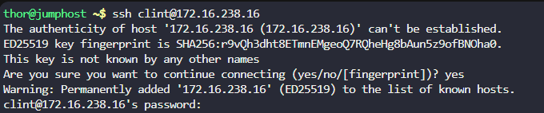
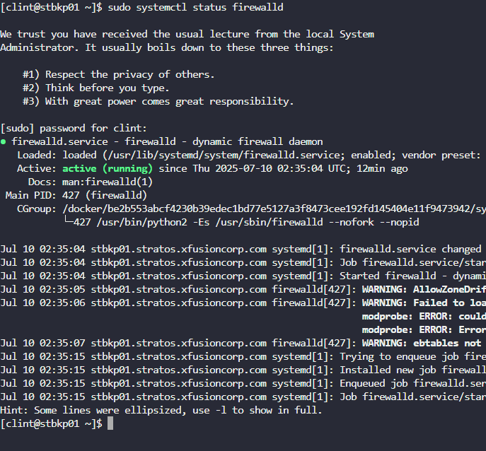
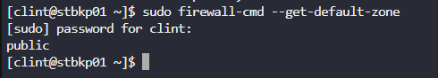
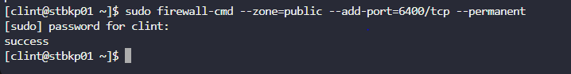
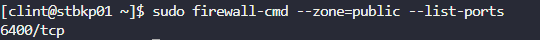

Mengizinkan semua koneksi masuk pada port 6400/tcp di Nautilus Backup Server (stbkp01).
Memastikan zona firewall diatur ke public.
Memverifikasi bahwa konfigurasi firewall aktif (bertahan setelah reboot).

Langkah 1: Akses Nautilus Backup Server (stbkp01)

Langkah 2: Verifikasi Status firewalld

Langkah 3: Periksa Zona Default

Langkah 4: Tambahkan Aturan untuk Port 6400/tcp

Langkah 5: Muat Ulang Konfigurasi Firewall

Langkah 6: Verifikasi Aturan Firewall

menerapkan konfigurasi firewalld untuk mengizinkan port 6400/tcp, memastikan hanya port yang diperlukan yang terbuka untuk aplikasi web UI.