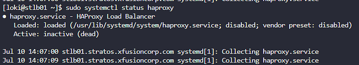

Mendiagnosis dan memperbaiki masalah dengan layanan HAProxy pada stlb01.

Memastikan HAProxy berjalan dan menyeimbangkan beban ke app server (stapp01, stapp02, stapp03) pada port 3000/tcp.

Memverifikasi bahwa website statis dapat diakses melalui stlb01:80 (via "StaticApp" button).

Langkah 1: Periksa Status Layanan HAProxy

Mengidentifikasi apakah HAProxy berjalan atau tidak.

Langkah 2: Mulai atau Restart Layanan HAProxy

Langkah 3: Periksa Konfigurasi HAProxy

Jika ada error, edit file konfigurasi
sudo nano /etc/haproxy/haproxy.cfg

error bagian user harusnya haproxy bukan haprox

configuration file is valid