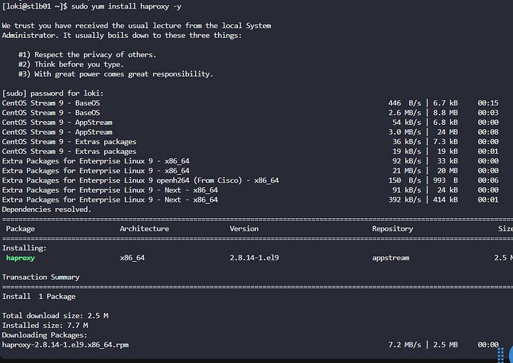
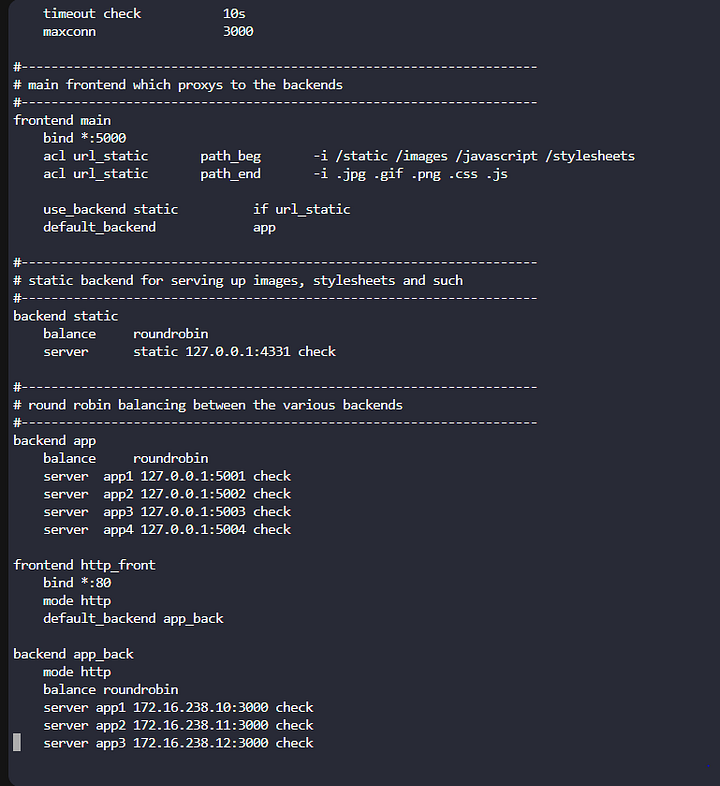
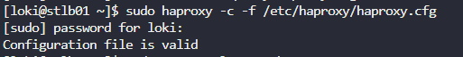
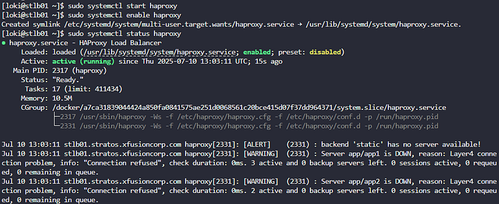
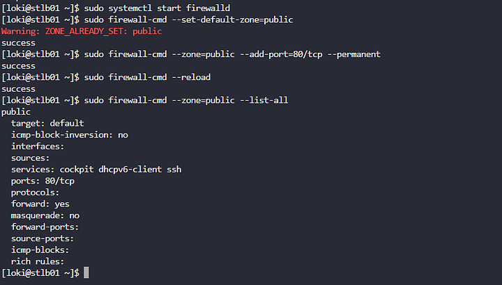
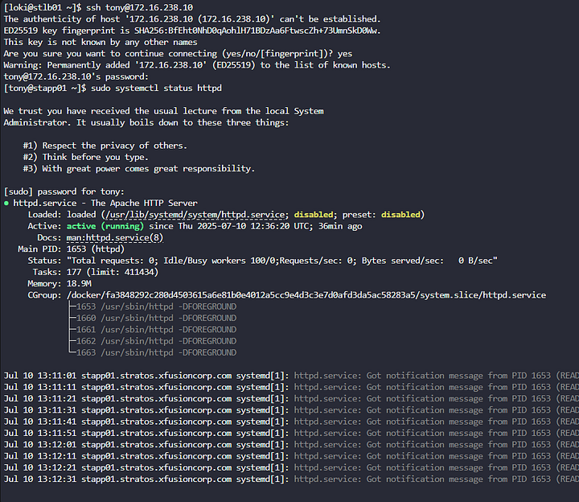
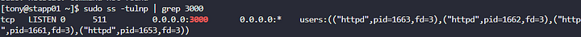
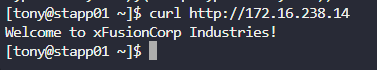

Menginstal HAProxy pada stlb01 menggunakan yum.
Mengkonfigurasi HAProxy untuk menyeimbangkan beban ke semua app server (stapp01, stapp02, stapp03) pada port 3000/tcp.
Memastikan HAProxy mendengarkan pada port 80/tcp untuk akses web.
Mempertahankan entri stats socket /var/lib/haproxy/stats di konfigurasi.
Memastikan layanan HAProxy berjalan dan website dapat diakses melalui stlb01

Langkah 1: Instal HAProxy

Langkah 2: Buat Cadangan File Konfigurasi HAProxy

Langkah 3: Konfigurasi HAProxy
sudo vi /etc/haproxy/haproxy.cfg

Langkah 4: Verifikasi Konfigurasi HAProxy
configuration file is valid

Langkah 5: Aktifkan dan Jalankan Layanan HAProxy

Langkah 6: Konfigurasi Firewall untuk Port 80/tcp

Langkah 7: Verifikasi Apache pada App Server
jalankan pada setiap app server:
Untuk stapp01

Verifikasi port 3000

Langkah 8: Uji Akses Website

website statis dapat diakses melalui HAProxy pada stlb01 port 80.

HAProxy sebagai reverse proxy pada port 80 memungkinkan akses publik ke website statis, sementara port 3000 pada app server dapat dibatasi oleh firewall untuk meningkatkan keamanan.