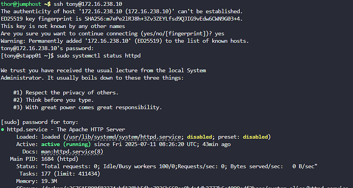

Load balancer adalah alat yang membagi lalu lintas jaringan (seperti permintaan website) ke beberapa server agar tidak ada server yang kelebihan beban.

Nginx di stlb01 akan bertindak sebagai load balancer, mengirimkan permintaan HTTP ke stapp01, stapp02, dan stapp03.

Nginx di stlb01 akan mendengarkan port 80 (HTTP) dan meneruskan permintaan ke Apache di server aplikasi.

Apache (httpd) adalah web server yang berjalan di setiap server aplikasi untuk menyajikan konten website.

Langkah 1: Instal Nginx di stlb01

Langkah 2: Periksa Status Apache di Server Aplikasi

Untuk stapp01:

Apache berjalan dan menggunakan port yang sudah dikonfigurasi.

Langkah 3: Konfigurasi Nginx sebagai Load Balancer

Langkah 4: Atur Izin File Konfigurasi

Langkah 5: Mulai dan Aktifkan Nginx

Langkah 6: Uji Load Balancer dari Jump Host

Nginx mendistribusikan lalu lintas ke server aplikasi, website dapat diakses melalui curl http://stlb01.stratos.xfusioncorp.com