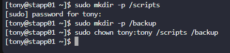
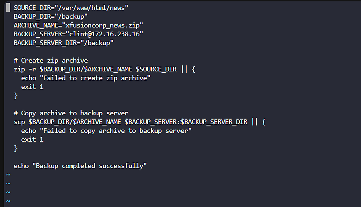
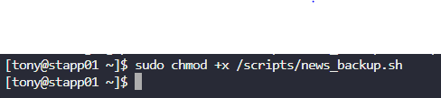

Membuat skrip bash news_backup.sh di /scripts pada stapp01 untuk mengotomatisasi backup website.
Membuat zip archive /var/www/html/news bernama xfusioncorp_news.zip dan menyimpannya di /backup/ pada stapp01.
Menyalin archive ke /backup/ pada stbkp01 tanpa meminta kata sandi.

Langkah 1: Buat Direktori /scripts dan /backup

Langkah 2: Buat Skrip news_backup.sh
nano /scripts/news_backup.sh

Langkah 3:Atur Izin Skrip

Langkah 4: Konfigurasi Autentikasi SSH Tanpa Kata Sandi
ssh-keygen -t rsa -b 2048
ssh-copy-id clint@172.16.238.16
Langkah 4: Persiapkan Direktori /backup di stbkp01
ssh clint@172.16.238.16
sudo mkdir -p /backup
sudo chmod 777 /backup
Langkah 5: Uji Skrip
/scripts/news_backup.sh