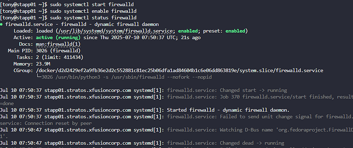
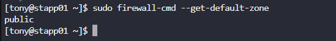
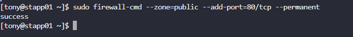
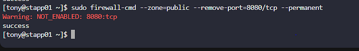
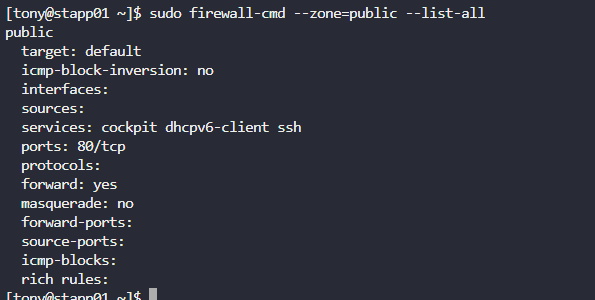
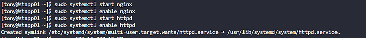
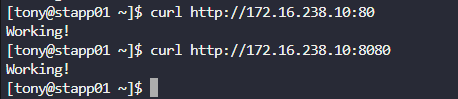

Menginstal firewalld pada semua app server (stapp01, stapp02, stapp03).
Mengizinkan semua koneksi masuk pada port 80/tcp (Nginx) di zona public.
Memblokir semua koneksi masuk pada port 8080/tcp (Apache) di zona public.
Memastikan semua aturan firewall bersifat permanen (bertahan setelah reboot).
Memastikan layanan Nginx dan Apache berjalan pada setiap server.

Langkah1: Aktifkan dan Jalankan Layanan firewalld

Langkah 2: Atur Zona Default ke Public

Langkah 3:Tambahkan Aturan untuk Port 80/tcp (Nginx)

Langkah 4: Blokir Port 8080/tcp (Apache)

Langkah 5: Muat Ulang Konfigurasi Firewall

Langkah 6: Verifikasi Aturan Firewall

Langkah 7: Pastikan Layanan Nginx dan Apache Berjalan

Langkah 8: Verifikasi Konektivitas Port

Mengizinkan hanya port 80/tcp dan memblokir 8080/tcp memastikan Nginx (reverse proxy) dapat diakses publik, sementara Apache (backend) hanya diakses melalui proxy, meningkatkan keamanan.