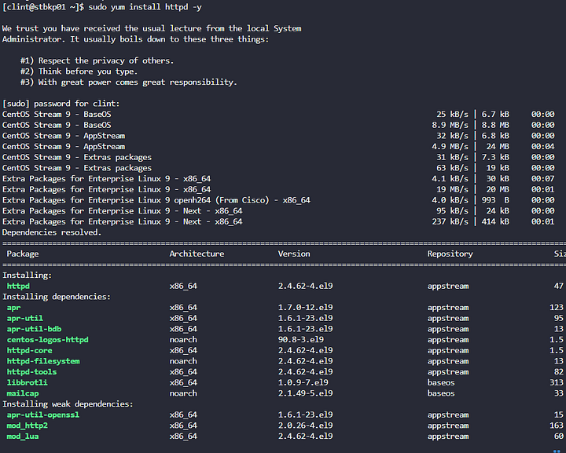
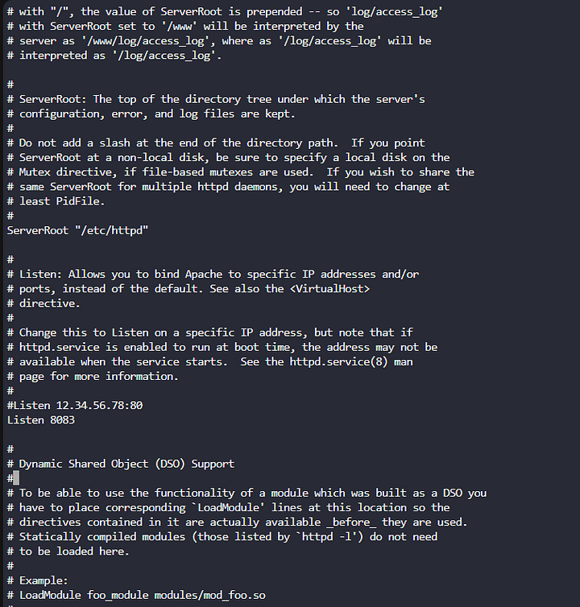
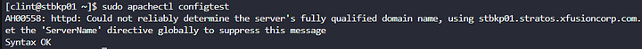
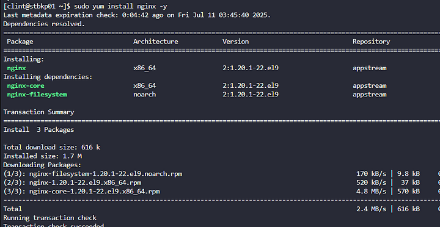
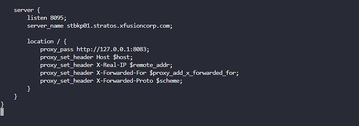
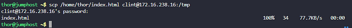
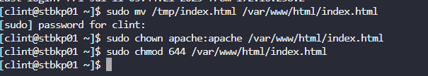
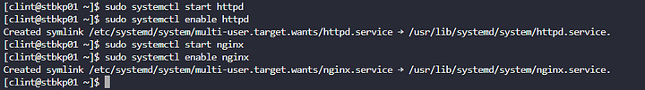
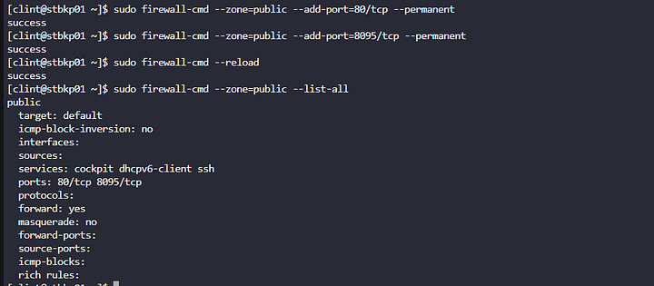

Menginstal dan mengkonfigurasi Apache pada stbkp01 untuk mendengarkan pada port 8083/tcp di semua interface.

Menginstal dan mengkonfigurasi Nginx pada stbkp01 untuk listen pada port 8095/tcp.

Mengatur Nginx sebagai reverse proxy untuk meneruskan permintaan dari port 8095 ke Apache pada port 8083.

Menyalin file index.html dari jump host ke document root Apache.

Memastikan kedua layanan berjalan dan dapat diakses melalui curl.

Memverifikasi bahwa firewall mengizinkan port 8083 dan 8095 tanpa memodifikasi pengaturan keamanan yang ada.

Langkah 1: Instal Apache (httpd)

Langkah 2: Konfigurasi Apache untuk Port 8083
sudo vi /etc/httpd/conf/httpd.conf

Syntax OK

Langkah 3: Instal Nginx

Langkah 4: Konfigurasi Nginx untuk Port 8095 dan Reverse Proxy

Mengatur Nginx untuk mendengarkan pada port 8095 dan bertindak sebagai reverse proxy ke Apache pada port 8083.
listen 8095: Nginx mendengarkan pada port 8095.
proxy_pass http://127.0.0.1:8083: Meneruskan permintaan ke Apache pada port 8083.
proxy_set_header: Menjaga informasi header untuk proxy.

Output nginx: configuration file /etc/nginx/nginx.conf test is successful

Langkah 5: Salin File index.html dari Jump Host

Perintah (di jump host):

Di stbkp01:

Menyalin index.html ke document root Apache
Langkah 6: Mulai Layanan Apache dan Nginx

Langkah 7: Verifikasi Firewall

Buka port 80 (HTTP)
sudo firewall-cmd - zone=public - add-port=80/tcp - permanent
Buka port 8095 (reverse proxy custom port)
sudo firewall-cmd - zone=public - add-port=8095/tcp - permanent
Reload firewall untuk menerapkan perubahan
sudo firewall-cmd - reload
sudo firewall-cmd - zone=public - list-all

Langkah 7: Uji Akses dari Jump Host

Nginx meneruskan permintaan ke Apache dan menampilkan index.html. menunjukkan isi file index.html

Menginstal Apache (port 8083) dan Nginx (port 8095) pada stbkp01, 
mengatur Nginx sebagai reverse proxy, menyalin index.html, dan menguji dengan curl.

Apache dan Nginx berjalan, Nginx mem-proksi ke Apache, index.html dapat diakses via curl http://stbkp01:8095.