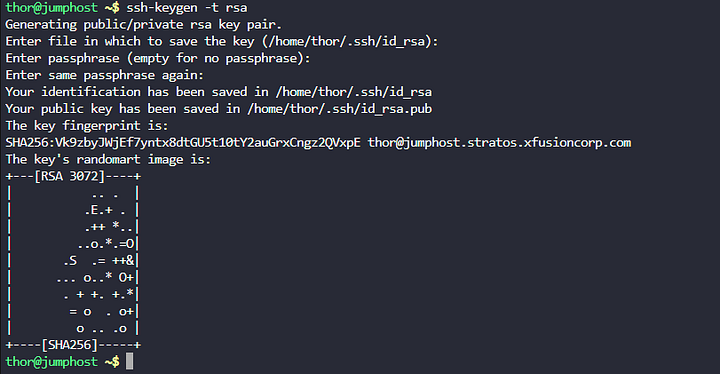
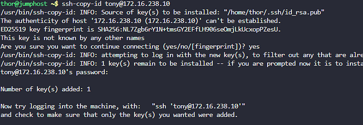

Mengatur autentikasi SSH tanpa kata sandi dari pengguna thor pada jump host ke semua app server (stapp01, stapp02, stapp03) melalui pengguna sudo masing-masing (tony, steve, banner).
Memastikan konfigurasi aman dan mendukung skrip otomatisasi yang dijalankan oleh thor.

Langkah 1: Hasilkan Pasangan Kunci SSH untuk thor

Langkah 2: Salin Kunci Publik ke Setiap App Server

Langkah 3: Uji Akses SSH Tanpa Kata Sandi

Mengatur autentikasi SSH tanpa kata sandi dari thor pada jump host ke tony@stapp01.