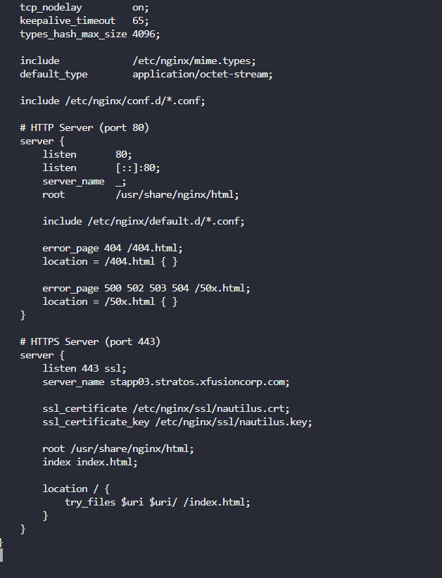

SSL (Secure Sockets Layer) adalah teknologi untuk mengamankan koneksi antara klien dan server dengan enkripsi. Sertifikat SSL (file .crt) dan kunci privat (file .key) digunakan untuk mengaktifkan HTTPS.

Document root adalah direktori tempat web server mencari file untuk disajikan ke klien. File index.html adalah halaman default yang ditampilkan saat klien mengakses URL tanpa menentukan file tertentu.

Document Root Nginx: Biasanya /usr/share/nginx/html pada CentOS atau /var/www/html pada Ubuntu.

Firewall adalah alat keamanan yang mengontrol lalu lintas jaringan berdasarkan aturan. Port 80 (HTTP) dan 443 (HTTPS) harus dibuka agar klien dapat mengakses web server.

Langkah 1: Instal Nginx

Langkah 2: Pindahkan dan Konfigurasi Sertifikat SSL

Langkah 3: Konfigurasi Nginx untuk HTTPS
sudo vi /etc/nginx/nginx.conf

Langkah 4: Buat File index.html

Langkah 5: Mulai dan Aktifkan Nginx

Langkah 6: Uji Akses dari Jump Host

Menginstal Nginx pada stapp03, mengkonfigurasi HTTPS dengan sertifikat self-signed, membuat index.html dengan konten "Welcome!", dan menguji dengan curl.

Nginx berjalan pada port 443, menyajikan index.html melalui HTTPS, dapat diakses via curl -Ik https://172.16.238.12/